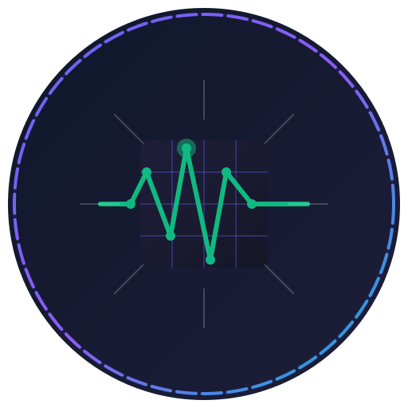
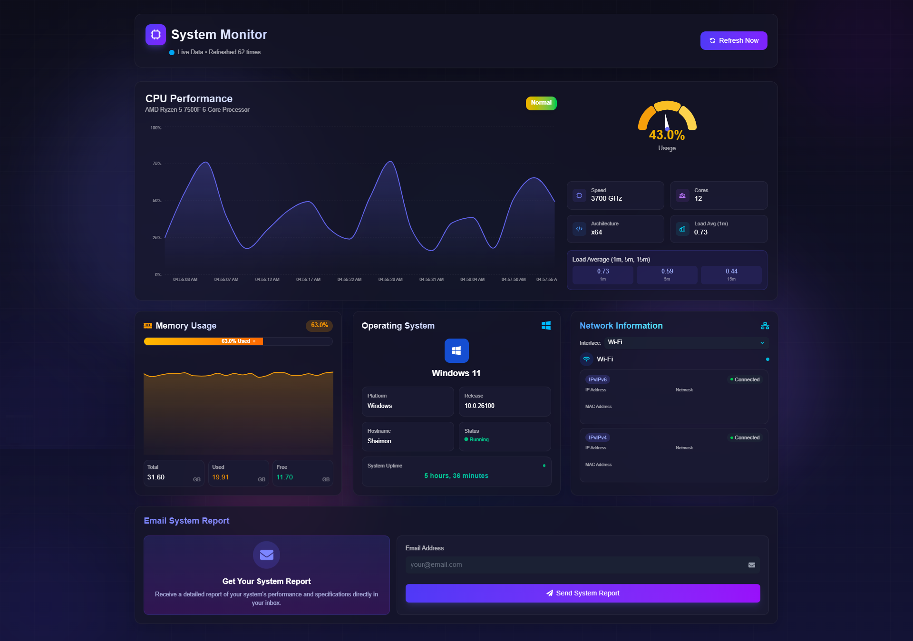

# System Monitor


<p align="center">
  
</p>

A modern, real-time system resource monitoring dashboard built with Next.js. System Monitor provides
a sleek, futuristic interface for tracking CPU performance, memory usage, network information, and
operating system details.



## ✨ Key Features

- **Real-time Monitoring**: Automatically refreshes system data at customizable intervals
- **Responsive Design**: Beautiful, mobile-friendly UI with dark mode
- **CPU Performance Tracking**:
  - Real-time CPU usage visualization with historical data
  - Multi-core support with detailed processor information
  - Color-coded status indicators (Optimal, Normal, High, Critical)
- **Memory Stats**:
  - Visual representation of RAM usage
  - Detailed memory allocation metrics
- **Network Information**:
  - Interface selection and details
  - IP address, netmask, and MAC address monitoring
- **OS Details**:
  - Operating system information
  - Uptime tracking and system specifications
- **Email Reporting**:
  - Send system reports via email
  - Configurable with Google SMTP support

## 🚀 Getting Started

### Prerequisites

- Node.js 16.0.0 or later
- npm or yarn

### Installation

1. Clone the repository:

   ```bash
   git clone https://github.com/al-shaimon/system-monitor.git
   cd system-monitor
   ```

2. Install dependencies:

   ```bash
   npm install
   # or
   yarn install
   ```

3. Create environment configuration:

   ```bash
   cp .env.example .env
   ```

4. Edit the `.env` file with your desired configuration (see [Configuration](#configuration) below)

5. Start the development server:

   ```bash
   npm run dev
   # or
   yarn dev
   ```

6. Open [http://localhost:3000](http://localhost:3000) to view the dashboard

## ⚙️ Configuration

The application uses environment variables for configuration. Edit your `.env` file with these
settings:

```
# API Configuration
NEXT_PUBLIC_API_ENDPOINT=/api/system

# Refresh Settings
NEXT_PUBLIC_REFRESH_INTERVAL=2000

# Application Settings
NEXT_PUBLIC_APP_NAME=System Monitor

# Google SMTP Configuration (for email reports)
SMTP_HOST=smtp.gmail.com
SMTP_PORT=587
SMTP_USER=your-email@gmail.com
SMTP_PASSWORD=your-app-password
```

### Environment Variables Explained

| Variable                       | Description                  | Default                    |
| ------------------------------ | ---------------------------- | -------------------------- |
| `NEXT_PUBLIC_API_ENDPOINT`     | API endpoint for system data | `/api/system`              |
| `NEXT_PUBLIC_REFRESH_INTERVAL` | Auto-refresh interval (ms)   | `2000`                     |
| `NEXT_PUBLIC_APP_NAME`         | Application name in the UI   | `System Monitor`           |
| `SMTP_HOST`                    | SMTP server for email        | `smtp.gmail.com`           |
| `SMTP_PORT`                    | SMTP port                    | `587`                      |
| `SMTP_USER`                    | SMTP username/email          | required for email feature |
| `SMTP_PASSWORD`                | SMTP password/app password   | required for email feature |

## 📧 Email Reporting Setup

### Setting up Google SMTP

1. Enable 2-Step Verification on your Google account
2. Generate an App Password:

   - Go to [Google Account Security](https://myaccount.google.com/security)
   - Under "Signing in to Google", select "App passwords"
   - Select "Mail" as the app and "Other" as the device
   - Enter "System Monitor" as the name
   - Click "Generate" and copy the 16-character password

3. Add the credentials to your `.env` file:
   ```
   SMTP_HOST=smtp.gmail.com
   SMTP_PORT=587
   SMTP_USER=your-email@gmail.com
   SMTP_PASSWORD=your-app-password
   ```

## 🛠️ Technology Stack

- **Frontend**:

  - Next.js 15 (App Router)
  - React 19
  - TailwindCSS V4 for styling
  - Framer Motion for animations
  - Recharts for data visualization

- **Backend**:
  - Next.js API Routes
  - Node.js system information libraries
  - Nodemailer for email functionality

## 📊 Components

The System Monitor consists of several key components:

- **Dashboard**: Main container that fetches and distributes system data
- **CPUStats**: CPU performance monitoring with historical chart and gauge
- **MemoryStats**: RAM usage visualization and metrics
- **NetworkInfo**: Network interface selection and details
- **OSInfo**: Operating system information display
- **EmailReport**: System report generation and email sending
- **ClientOnlyGauge**: Server-side rendering compatible gauge component

## 🚢 Deployment

### Production Build

1. Create a production build:

   ```bash
   npm run build
   # or
   yarn build
   ```

2. Start the production server:
   ```bash
   npm start
   # or
   yarn start
   ```

### Deploy on Vercel

The easiest way to deploy the System Monitor is to use [Vercel](https://vercel.com):

1. Push your code to a Git repository (GitHub, GitLab, or Bitbucket)
2. Import the project in Vercel
3. Add your environment variables in the Vercel project settings
4. Deploy

## 🔧 Advanced Usage

### Adding Custom Metrics

The System Monitor is designed to be extensible. To add custom metrics:

1. Add new data fields to the API response in `/api/system/route.ts`
2. Create a new component in `src/components/`
3. Add the component to the Dashboard grid in `src/components/Dashboard.tsx`

### Adjusting Refresh Rates

The default refresh rate is 2 seconds. Adjust the `NEXT_PUBLIC_REFRESH_INTERVAL` environment
variable to change this globally.

## 📄 License

This project is licensed under the MIT License - see the [LICENSE](LICENSE) file for details.

## 🤝 Contributing

Contributions are welcome! Please feel free to submit a Pull Request.

1. Fork the repository
2. Create your feature branch (`git checkout -b feature/amazing-feature`)
3. Commit your changes (`git commit -m 'Add some amazing feature'`)
4. Push to the branch (`git push origin feature/amazing-feature`)
5. Open a Pull Request
